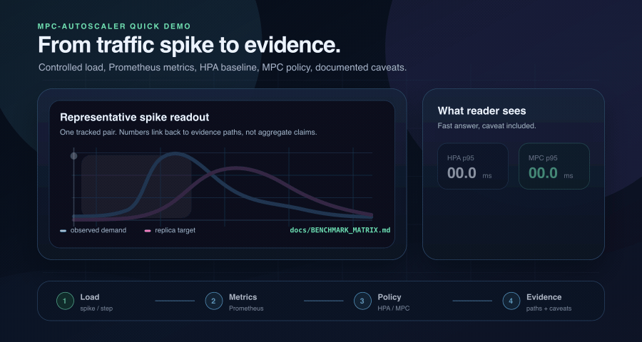
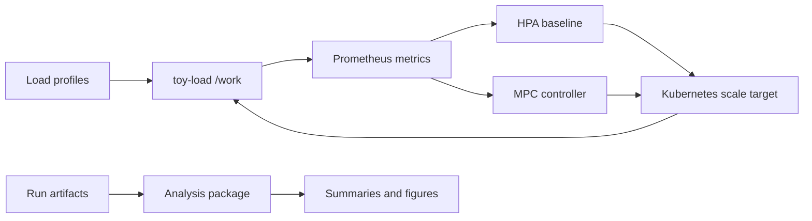

# mpc-autoscaler

Model Predictive Control Kubernetes autoscaling lab comparing reactive HPA baselines with a small MPC controller, backed by Prometheus/Grafana evidence, local simulation paths, and scoped good-first issues.

[](https://github.com/vshulcz/mpc-autoscaler/actions/workflows/ci.yaml)
[](https://github.com/vshulcz/mpc-autoscaler/actions/workflows/release.yaml)
[](https://github.com/vshulcz/mpc-autoscaler/actions/workflows/tag-release.yaml)
[](https://github.com/vshulcz/mpc-autoscaler/actions/workflows/pages.yaml)
[](https://github.com/vshulcz/mpc-autoscaler/actions/workflows/security.yaml)
[](https://github.com/vshulcz/mpc-autoscaler/actions/workflows/codeql.yaml)
[](https://github.com/vshulcz/mpc-autoscaler/actions/workflows/trivy.yaml)
[](https://securityscorecards.dev/viewer/?uri=github.com/vshulcz/mpc-autoscaler)
[](https://codecov.io/gh/vshulcz/mpc-autoscaler)
[](LICENSE)


Research lab for one question: when traffic jumps, can a small Model Predictive Control loop scale earlier than a reactive HPA baseline on a controlled Kubernetes workload?

This is not a production autoscaler. It is a runnable experiment system: a controllable Go workload, Helm deployment, Prometheus metrics, HPA baseline, MPC controller, offline simulator, and evidence docs.

## Follow The Experiments

Star or watch this repository if you want to follow reproducible autoscaling experiments: HPA settings, MPC variants, future KEDA/predictive baselines, trace shapes, failure cases, dashboards, and evidence packaging. The goal is not to claim MPC always wins; it is to make each comparison inspectable.

## Want To Contribute In 10 Minutes?

You do not need a Kubernetes cluster for many useful first contributions.

| If you want to help with... | Start here |
| --- | --- |
| a small verified PR | Pick a [`good first issue`](https://github.com/vshulcz/mpc-autoscaler/labels/good%20first%20issue) or read [`docs/MICRO_CONTRIBUTIONS.md`](docs/MICRO_CONTRIBUTIONS.md). |
| reproducibility feedback | Run the bundled trace validation path below and open the [reproduction feedback form](https://github.com/vshulcz/mpc-autoscaler/issues/new?template=reproduction_feedback.yml). |
| methodology critique | Read the [60-second walkthrough](docs/MPC_VS_HPA_60_SECONDS.md), then challenge baselines, traces, or failure cases. |

Good first PRs usually improve one command, one link, one metric explanation, one setup note, or one docs example, then show the exact check used.

## MPC vs HPA In 60 Seconds

| Start here | Why it matters |
| --- | --- |
| [`docs/MPC_VS_HPA_60_SECONDS.md`](docs/MPC_VS_HPA_60_SECONDS.md) | Fast technical walkthrough: problem, current spike result, trust boundary, and feedback asks. |
| [`docs/RESULTS.md`](docs/RESULTS.md) | Exact current numbers, evidence paths, caveats, and rebuild commands. |
| [`docs/BENCHMARK_MATRIX.md`](docs/BENCHMARK_MATRIX.md) | Shows which cells have public numbers and which are only indexed evidence roots. |
| [`docs/DEMO.md`](docs/DEMO.md) | Ten-second visual loop from traffic spike to evidence. |

The shortest local check uses the bundled spike trace:

```bash
python3 -m pip install -e analysis
mpc-validate-trace --trace-csv analysis/mpc_autoscaler_analysis/data/traces/baseline_spike_profile_dt15.csv
mpc-offline-sim \
  --trace-csv analysis/mpc_autoscaler_analysis/data/traces/baseline_spike_profile_dt15.csv \
  --out-dir analysis/out/offline/spike
```

## Current Status

In one tracked 200 rps spike pair, Hybrid-SA MPC showed lower burst p95 latency than the HPA60 baseline while both runs kept `100%` request success. This is a representative snapshot, not a final benchmark claim. Exact paths, caveats, and rebuild commands live in [`docs/RESULTS.md`](docs/RESULTS.md).

| What you can inspect | Path |
| --- | --- |
| Results snapshot and caveats | [`docs/RESULTS.md`](docs/RESULTS.md) |
| Benchmark matrix | [`docs/BENCHMARK_MATRIX.md`](docs/BENCHMARK_MATRIX.md) |
| 60-second technical walkthrough | [`docs/MPC_VS_HPA_60_SECONDS.md`](docs/MPC_VS_HPA_60_SECONDS.md) |
| Ten-second demo narrative | [`docs/DEMO.md`](docs/DEMO.md) |
| Public interface | [`docs/API.md`](docs/API.md) |
| Methodology | [`docs/METHODOLOGY.md`](docs/METHODOLOGY.md) |
| Known limitations | [`docs/LIMITATIONS.md`](docs/LIMITATIONS.md) |
| Static docs site | <https://vshulcz.github.io/mpc-autoscaler/> |
| Public roadmap | <https://github.com/users/vshulcz/projects/2> |
| Q&A for setup and reproducibility | <https://github.com/vshulcz/mpc-autoscaler/discussions/77> |

Methodology feedback, baseline suggestions, reproduction reports, and verified small PRs are more useful than broad wording-only rewrites.

## Feedback That Helps

| Time | Best contribution |
| --- | --- |
| 5 minutes | Read the 60-second walkthrough and say which assumption makes the comparison least convincing. |
| 15 minutes | Run the bundled trace validation command and report whether setup instructions were enough. |
| 1 hour | Run one offline simulation, paste the output paths, and suggest one chart or table that would make results easier to judge. |
| Deeper | Propose a stronger baseline, comparator, trace, or failure case with enough detail to turn it into an experiment issue. |

Open feedback through the [Q&A thread](https://github.com/vshulcz/mpc-autoscaler/discussions/77) or the [reproduction feedback issue template](https://github.com/vshulcz/mpc-autoscaler/issues/new?template=reproduction_feedback.yml). Use Issues for tracked bugs and scoped implementation work.

AI-assisted micro PRs are also welcome when they are small and verified. Start with [`docs/MICRO_CONTRIBUTIONS.md`](docs/MICRO_CONTRIBUTIONS.md) or open the [micro contribution issue form](https://github.com/vshulcz/mpc-autoscaler/issues/new?template=micro_contribution.yml).

Docs site: <https://vshulcz.github.io/mpc-autoscaler/>.

Roadmap board: <https://github.com/users/vshulcz/projects/2>. Active work is tracked through milestones `v0.2.0`, `thesis-reproducibility`, and `v0.3.0`.

For setup questions, reproduction help, and "which path should I use?" questions, use the [Q&A entry thread](https://github.com/vshulcz/mpc-autoscaler/discussions/77). If an answer solves your question, mark it as accepted so the next reader can find it quickly. For lightweight contribution ideas or small PR proposals, use the [Discussions starter thread](https://github.com/vshulcz/mpc-autoscaler/discussions/26).

Contribution guidelines live in `CONTRIBUTING.md`. Support guidance lives in `SUPPORT.md`. Release steps are documented in `docs/RELEASE.md`. Security reporting guidance lives in `SECURITY.md`.

## Results Snapshot

Representative tracked spike runs, not aggregate benchmark results:

| Controller | Burst throughput | Burst p95 | Burst p99 | Max latency | Success | Max replicas |
| --- | ---: | ---: | ---: | ---: | ---: | ---: |
| HPA60 baseline | 197.91 rps | 85.175 ms | 128.983 ms | 276.229 ms | 100.00% | 27 |
| Hybrid-SA MPC | 199.90 rps | 52.483 ms | 71.048 ms | 97.157 ms | 100.00% | 28 |

See [`docs/RESULTS.md`](docs/RESULTS.md), [`docs/METHODOLOGY.md`](docs/METHODOLOGY.md), and [`docs/LIMITATIONS.md`](docs/LIMITATIONS.md) before interpreting the numbers.

For broader coverage, see [`docs/BENCHMARK_MATRIX.md`](docs/BENCHMARK_MATRIX.md). It separates indexed evidence roots from published numeric claims so missing cells stay visible.

## Ten-Second Demo



The short version: controlled traffic hits `toy-load`, Prometheus exposes service metrics, HPA reacts to measured pressure, MPC forecasts short-horizon demand, and analysis tools compare latency, success, and replica behavior. Full storyboard: [`docs/DEMO.md`](docs/DEMO.md).

## Repository Contents

- controllable HTTP workload with Prometheus metrics, Helm chart, raw manifests, and GHCR release image;
- online MPC controller that can run in dry-run mode or apply Kubernetes scale decisions;
- offline simulator and grid-search tooling for controller tuning;
- repeatable HPA and MPC runners for `step`, `spike`, and `seasonality` scenarios;
- curated evidence policy that keeps bulky raw runs out of Git while preserving provenance;
- CI, release, dependency-update, issue-template, and security automation for public maintenance.

The project combines three parts:

- `toy-load/`: a standalone Go module with a controllable HTTP workload service. See `toy-load/README.md` for API details and the [runtime configuration table](toy-load/README.md#configuration).
- `analysis/`: offline and online MPC tooling used to tune and evaluate the controller.
- `deploy/`, `dashboards/`, and `loadgen/`: ArgoCD applications, monitoring assets, Grafana dashboards, and repeatable load-generation scripts. See `loadgen/README.md` for runner details.

## Scope

This repository is intended for controlled experiments rather than production use. The goal is to compare a reactive HPA-style policy against an MPC-based controller under reproducible traffic profiles, while keeping assumptions and limitations visible.

Supported experiment scenarios:

- `step`: sustained increase in load.
- `spike`: short high-intensity burst.
- `seasonality`: smooth sinusoidal variation.

## For Practitioners

Use this repository when you need:

- a small Kubernetes autoscaling lab that can be inspected end to end;
- a controllable workload for testing metrics, HPA behavior, dashboards, and load profiles;
- a reproducible comparison pattern for reactive and predictive scaling policies;
- examples of evidence packaging, caveats, release automation, and public research-software maintenance.

Do not use it as:

- a drop-in production autoscaler;
- proof that MPC is generally better than HPA;
- tuning advice for arbitrary clusters or workloads.

Public contracts and scripting surfaces are documented in [`docs/API.md`](docs/API.md).

## Architecture



See `docs/ARCHITECTURE.md` for component boundaries, data flow, and extension points.

## Prerequisites

- Go `1.25`
- Python `3.11+`
- Docker
- `kubectl`
- Helm
- access to a Kubernetes cluster for online experiments

Optional but useful:

- `vegeta` for local load generation
- `coverage.py` for local Python coverage reports
- a local virtual environment in `.venv/` for Python tooling

## Repository Layout

```text
toy-load/                      Standalone Go module for the controllable workload service
  cmd/toy-load/                Go application entry point
  internal/                    Config, HTTP handling, metrics, and workload simulation
  deploy/helm/toy-load/        Helm chart for the service
  deploy/manifests/            Raw Kubernetes manifests for the service
analysis/
  mpc_autoscaler_analysis/     Python package for offline simulation, online control, and artifact summaries
  mpc_autoscaler_analysis/data/traces/
                                Small input traces for offline simulations
  tests/                       Dependency-light unit tests for analysis tooling
deploy/
  argocd/                      ArgoCD applications
  monitoring/                  Kustomize monitoring stack manifests used in experiments
dashboards/                    Grafana dashboard JSON
loadgen/scripts/               Local and in-cluster load-generation entry points
docs/                          Architecture, reproducibility, and release notes
```

New experiment artifacts are written to ignored `experiments/_runs/` by default.
Curated local evidence and archive roots stay ignored under `experiments/`; the
repository commits only lightweight indices and packaging instructions.

## Main Entry Points

These are the scripts and commands you are most likely to use:

- `make -C toy-load run`: run the service locally.
- `bash loadgen/scripts/run_hpa_experiment_incluster.sh <scenario>`: run one HPA baseline experiment in-cluster.
- `bash loadgen/scripts/run_mpc_experiment_incluster.sh <scenario>`: run one MPC-controlled experiment in-cluster.
- `bash loadgen/scripts/run_hpa_mpc_batch.sh [N_MPC [N_HPA]]`: run matched HPA and MPC batches.
- `bash loadgen/scripts/run_mpc_v3_batch.sh [scenario|all]`: run the calibrated MPC-only batch.
- `mpc-offline-sim ...`: run the offline simulator on a trace after installing `analysis`.
- `mpc-validate-trace ...`: check an offline trace CSV before simulation.
- `docs/REPRODUCIBILITY.md`: choose the lightest reproduction path for local checks, offline simulation, saved evidence, or live cluster runs.

## Local Development

Run the service:

```bash
make toy-load-run
curl "http://localhost:9090/work?cpu_ms=10&jitter_ms=5"
curl http://localhost:9090/metrics
```

Useful Make targets:

```bash
make help
make fmt
make check
make coverage
make toy-load-run
make toy-load-build
```

`make check` runs the toy-load checks used in CI: formatting check, `go vet`, tests, Helm lint, and Helm template rendering.
`make coverage` writes Go and Python coverage reports under ignored `coverage/`.

## Five-Minute Paths

No cluster needed:

```bash
python3 -m venv .venv
source .venv/bin/activate
pip install -e analysis
mpc-generate-synthetic-trace --scenario spike --out analysis/out/spike.csv
mpc-validate-trace --trace-csv analysis/out/spike.csv
mpc-offline-sim --trace-csv analysis/out/spike.csv --out-dir analysis/out/offline/spike
```

Service smoke test:

```bash
make toy-load-run
```

In another terminal:

```bash
curl http://localhost:9090/healthz
curl "http://localhost:9090/work?cpu_ms=10&jitter_ms=5"
curl http://localhost:9090/metrics
```

## Python Environment

For offline analysis and the online MPC controller, create a virtual environment and install the analysis package:

```bash
python3 -m venv .venv
source .venv/bin/activate
pip install -e analysis
```

Example offline run:

```bash
mpc-generate-synthetic-trace \
  --scenario step \
  --out analysis/out/step.csv

mpc-validate-trace \
  --trace-csv analysis/out/step.csv

mpc-offline-sim \
  --trace-csv analysis/out/step.csv \
  --out-dir analysis/out/offline/step
```

## Deployment

Deploy with Helm:

```bash
helm upgrade --install toy-load toy-load/deploy/helm/toy-load \
  --namespace default \
  --create-namespace
```

Or apply the raw manifests:

```bash
kubectl apply -f toy-load/deploy/manifests
```

Monitoring manifests require Prometheus Operator and Grafana Operator CRDs:

```bash
kubectl apply -k deploy/monitoring
```

ArgoCD application manifests live under `deploy/argocd/`.

The Helm chart defaults to `ghcr.io/vshulcz/toy-load:main`. For a pinned run, override the tag explicitly:

```bash
helm upgrade --install toy-load toy-load/deploy/helm/toy-load \
  --namespace default \
  --set image.tag=<commit-or-release-tag>
```

## Verifying Release Downloads

GitHub Releases include cross-platform `toy-load` binaries, a packaged Helm
chart, and `SHA256SUMS`. Verify downloaded assets before unpacking or installing
them.

Linux:

```bash
VERSION=v0.1.0
ARCH=amd64 # or arm64
BASE="https://github.com/vshulcz/mpc-autoscaler/releases/download/${VERSION}"

curl -LO "${BASE}/toy-load-${VERSION}-linux-${ARCH}.tar.gz"
curl -LO "${BASE}/toy-load-${VERSION#v}.tgz"
curl -LO "${BASE}/SHA256SUMS"

grep -E " (toy-load-${VERSION}-linux-${ARCH}.tar.gz|toy-load-${VERSION#v}.tgz)$" SHA256SUMS \
  | sha256sum -c -
```

macOS:

```bash
VERSION=v0.1.0
ARCH=arm64 # or amd64
BASE="https://github.com/vshulcz/mpc-autoscaler/releases/download/${VERSION}"

curl -LO "${BASE}/toy-load-${VERSION}-darwin-${ARCH}.tar.gz"
curl -LO "${BASE}/toy-load-${VERSION#v}.tgz"
curl -LO "${BASE}/SHA256SUMS"

grep -E " (toy-load-${VERSION}-darwin-${ARCH}.tar.gz|toy-load-${VERSION#v}.tgz)$" SHA256SUMS \
  | shasum -a 256 -c -
```

## Running Experiments

For a staged reproduction path, start with `docs/REPRODUCIBILITY.md`. It separates local checks, offline simulations, saved-artifact summaries, live Kubernetes experiments, and release reproduction.

Single-run baseline and MPC workflows:

```bash
# HPA baseline
bash loadgen/scripts/run_hpa_experiment_incluster.sh step

# MPC controller
bash loadgen/scripts/run_mpc_experiment_incluster.sh step
```

Matched batch runs:

```bash
# default: 5 MPC runs and 3 HPA runs per scenario
bash loadgen/scripts/run_hpa_mpc_batch.sh

# custom counts
bash loadgen/scripts/run_hpa_mpc_batch.sh 3 2
```

Calibrated MPC-only batch:

```bash
# 8 calibrated MPC v3 runs per scenario
bash loadgen/scripts/run_mpc_v3_batch.sh all
```

Batch logs are written to ignored `experiments/_runs/progress/`.

## Result Summaries

The online controller writes a CSV control log for each MPC run. A helper script converts run artifacts into compact CSV summaries:

```bash
mpc-summarize-run \
  --run-dir experiments/_runs/mpc-online/step/<run-id> \
  --out-phase-csv /tmp/step_phases.csv \
  --out-control-csv /tmp/step_control.csv
```

## MPC Formulation

The controller uses a backlog-state MPC formulation.

State update between control ticks:

```math
b_0^{(t)} = \max\!\left(0,\; b_0^{(t-1)} + \Delta t(\lambda_{t-1} - \mu\rho^\star r_{t-1})\right)
```

Optimization problem solved each tick:

```math
\min_{x,b}\; \alpha\lVert b\rVert_2^2 + \beta\lVert D x - e_1 r_t\rVert_2^2 + \gamma \mathbf{1}^{\mathsf{T}}x
```

subject to:

```math
\begin{aligned}
b_k &\ge b_{k-1} + \Delta t(\hat\lambda_{t+k} - \mu\rho^\star x_k), \\
b_k &\ge 0, \\
\lvert x_k - x_{k-1}\rvert &\le x^{\max\text{-step}}, \\
x^{\min} &\le x_k \le x^{\max}.
\end{aligned}
```

Here, $\hat\lambda$ is a short-horizon demand forecast, $\mu$ is the calibrated throughput capacity per replica, and $\rho^\star$ is the target utilisation threshold.

## Observability

Key metrics exported by `toy-load`:

| Metric | Meaning |
| --- | --- |
| `toy_http_requests_total{method,path,code}` | request count |
| `toy_http_request_duration_seconds` | request latency histogram |
| `toy_in_flight_requests` | current number of in-flight requests |
| `toy_work_cpu_ms` | requested CPU work per request |
| `toy_errors_total{reason}` | application error counters |

Useful PromQL queries:

```promql
sum(rate(toy_http_requests_total{path="/work"}[1m]))

histogram_quantile(
  0.95,
  sum(rate(toy_http_request_duration_seconds_bucket{path="/work"}[1m])) by (le)
)

toy_in_flight_requests
```

## CI And Releases

GitHub Actions runs the following checks on pushes and pull requests:

- formatting check with `gofmt`
- `go vet` in `toy-load/`
- `go test ./...` in `toy-load/`
- Go and Python coverage collection with uploaded CI artifacts
- dependency-light Python unit tests and compile checks
- shell syntax checks for experiment runners
- GitHub Actions workflow linting with `actionlint`
- JSON validation for Grafana dashboards and Helm schema
- Helm lint
- Helm template rendering
- Kustomize rendering for monitoring manifests
- CodeQL analysis for Go and Python
- Go vulnerability scanning with `govulncheck`
- Trivy filesystem and container image scanning with SARIF uploads
- OpenSSF Scorecard supply-chain checks
- dependency review on pull requests

Container images are built and published to `ghcr.io/vshulcz/toy-load` on main pushes and release runs. Tags include `main`, `sha-*`, semver release tags, and `latest` for semver releases.
The image build also publishes SBOM and provenance attestations.

Release automation is tag driven:

- run the `Tag Release` workflow with a tag like `v0.1.0`, or push an annotated `v*.*.*` tag manually;
- `Release` builds cross-platform `toy-load` binaries, packages the Helm chart, writes checksums, publishes the GHCR image, and creates a GitHub Release.

See `docs/RELEASE.md` for the full release checklist.

## Contributing

Useful contribution areas include controller comparators, traffic traces, dashboard panels, artifact parsers, Kubernetes portability, and documentation for reproducible experiments.

See `ROADMAP.md` for project directions and `CONTRIBUTING.md` before opening a pull request.

Current small-PR queue: [Contributor sprint discussion](https://github.com/vshulcz/mpc-autoscaler/discussions/94).

Contribution scope:

| Time | Good first contribution |
| --- | --- |
| 5 minutes | Fix links, examples, glossary text, or README wording. |
| 15 minutes | Add one smoke-test command, metric explanation, or docs-site card. |
| 1 hour | Add a parser test, dashboard panel note, or release verification example. |
| Deeper | Compare controllers, improve benchmark summaries, or add reproducible figures. |
## External Contributors

Thanks to contributors whose pull requests have shipped in this repository:

| Contributor | Shipped work |
| --- | --- |
| [@dicnunz](https://github.com/dicnunz) | Release checksum verification docs in #25. |
| [@tatakaisun](https://github.com/tatakaisun) | toy-load examples, environment docs, Helm/loadgen references, trace sample docs, and trace CSV validator work in #37-#44. |
| [@ayushkli86](https://github.com/ayushkli86) | support guide, docs-only checklist, labeler docs, and security footer link in #57-#60. |
| [@msaqibatifj](https://github.com/msaqibatifj) | toy-load HTTP status code reference in #95. |
| [@mahek56](https://github.com/mahek56) | API stable-vs-unstable documentation example row in #114, plus evidence alias documentation in #115. |
| [@kunal-9090](https://github.com/kunal-9090) | loadgen, analysis setup, Helm resource, evidence alias, dashboard metric, trace examples, results source links, PR template, and contributing docs in #98-#107. |

Merged external PRs are credited here and in release notes when they affect a release.

## License

Apache License 2.0. See `LICENSE`.
