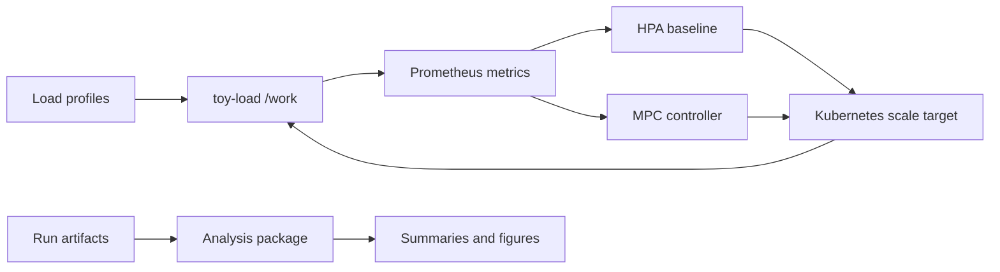

# mpc-autoscaler

**Can a predictive controller scale Kubernetes earlier than a reactive HPA — and where does it fail?** A reproducible lab to find out.

[](https://github.com/vshulcz/mpc-autoscaler/actions/workflows/ci.yaml)
[](https://codecov.io/gh/vshulcz/mpc-autoscaler)
[](LICENSE)


In one tracked 200 rps spike, the MPC controller cut burst **p95 latency ~38%** (85 → 52 ms) and **p99 ~45%**, both runs at **100% success**.

Then I shortened the spike to 30 seconds — and MPC lost. New Pods became Ready about **40 seconds** after the decision, *after the spike was already over*. The bottleneck wasn't the algorithm; it was the time Kubernetes needs to deliver ready capacity.

That gap — a correct decision arriving before usable capacity — is what this repo lets you measure, reproduce, and break.

This is not a production autoscaler. It is a runnable experiment system: a controllable Go workload, Helm deployment, Prometheus metrics, an HPA baseline, an MPC controller, an offline simulator, and evidence docs.

## Results snapshot

One representative tracked spike pair (not an aggregate benchmark — see [`docs/RESULTS.md`](docs/RESULTS.md) and [`docs/LIMITATIONS.md`](docs/LIMITATIONS.md) before drawing conclusions):

| Controller | Burst throughput | Burst p95 | Burst p99 | Max latency | Success | Max replicas |
| --- | ---: | ---: | ---: | ---: | ---: | ---: |
| HPA60 baseline | 197.91 rps | 85.175 ms | 128.983 ms | 276.229 ms | 100.00% | 27 |
| Hybrid-SA MPC | 199.90 rps | 52.483 ms | 71.048 ms | 97.157 ms | 100.00% | 28 |

The honest twist: on a short 30s spike the same controller loses on tail latency, because readiness lag (~40s) is longer than the spike. The point of the lab is to make every such case inspectable, not to claim MPC always wins.

## Try it in 60 seconds (no cluster needed)

```bash
python3 -m venv .venv && source .venv/bin/activate
pip install -e analysis
mpc-validate-trace --trace-csv analysis/mpc_autoscaler_analysis/data/traces/baseline_spike_profile_dt15.csv
mpc-offline-sim \
  --trace-csv analysis/mpc_autoscaler_analysis/data/traces/baseline_spike_profile_dt15.csv \
  --out-dir analysis/out/offline/spike
```

This validates the bundled spike trace and runs the offline simulator end to end (writes `summary.json`, `trajectory.csv`, and a plot). For staged paths — offline sim, saved evidence, live cluster runs — see [`docs/REPRODUCIBILITY.md`](docs/REPRODUCIBILITY.md).

## Contribute

You do not need a Kubernetes cluster for many useful first contributions.

- **Make a small verified PR** — pick a [`good first issue`](https://github.com/vshulcz/mpc-autoscaler/labels/good%20first%20issue), then read [`CONTRIBUTING.md`](CONTRIBUTING.md).
- **Challenge the methodology** — read the [60-second walkthrough](docs/MPC_VS_HPA_60_SECONDS.md) and tell me which assumption makes the comparison least convincing, via the [Q&A thread](https://github.com/vshulcz/mpc-autoscaler/discussions/77) or a [reproduction report](https://github.com/vshulcz/mpc-autoscaler/issues/new?template=reproduction_feedback.yml).

Useful areas: controller comparators, traffic traces, dashboard panels, artifact parsers, Kubernetes portability, and reproducibility docs. See [`ROADMAP.md`](ROADMAP.md) for directions.

Recent external contributors: [@dicnunz](https://github.com/dicnunz), [@tatakaisun](https://github.com/tatakaisun), [@ayushkli86](https://github.com/ayushkli86), [@msaqibatifj](https://github.com/msaqibatifj), [@mahek56](https://github.com/mahek56), [@kunal-9090](https://github.com/kunal-9090). Merged PRs are credited in release notes.

## What's inside



- `toy-load/` — a standalone Go module: controllable HTTP workload with Prometheus metrics, Helm chart, manifests, and a GHCR release image.
- `analysis/` — offline simulator, online MPC controller, grid-search tooling, and artifact summaries.
- `deploy/`, `dashboards/`, `loadgen/` — ArgoCD apps, monitoring manifests, Grafana dashboards, and repeatable load runners.

Supported scenarios: `step` (sustained increase), `spike` (short burst), `seasonality` (smooth sinusoidal).

## Where to go next

| Document | What it covers |
| --- | --- |
| [`docs/MPC_VS_HPA_60_SECONDS.md`](docs/MPC_VS_HPA_60_SECONDS.md) | Fast technical walkthrough: problem, current spike result, trust boundary. |
| [`docs/RESULTS.md`](docs/RESULTS.md) | Exact numbers, evidence paths, caveats, rebuild commands. |
| [`docs/METHODOLOGY.md`](docs/METHODOLOGY.md) | Experiment design and the MPC formulation. |
| [`docs/LIMITATIONS.md`](docs/LIMITATIONS.md) | What these numbers do **not** prove. |
| [`docs/BENCHMARK_MATRIX.md`](docs/BENCHMARK_MATRIX.md) | Which cells have published numbers vs. indexed evidence roots. |
| [`docs/ARCHITECTURE.md`](docs/ARCHITECTURE.md) | Component boundaries, data flow, extension points. |
| [`docs/API.md`](docs/API.md) | Public contracts and scripting surfaces. |
| [`docs/REPRODUCIBILITY.md`](docs/REPRODUCIBILITY.md) | Staged reproduction paths. |
| [`docs/DEMO.md`](docs/DEMO.md) | Ten-second demo storyboard. |
| [Docs site](https://vshulcz.github.io/mpc-autoscaler/) · [Roadmap board](https://github.com/users/vshulcz/projects/2) | Hosted overview and tracked work. |

## Prerequisites

For offline work: Go `1.25`, Python `3.11+`. For live experiments also: Docker, `kubectl`, Helm, and a Kubernetes cluster. (`vegeta` optional for local load.)

<details>
<summary><strong>Running experiments on a cluster</strong></summary>

Deploy the workload:

```bash
helm upgrade --install toy-load toy-load/deploy/helm/toy-load \
  --namespace default --create-namespace
# or: kubectl apply -f toy-load/deploy/manifests
```

Monitoring manifests require Prometheus/Grafana Operator CRDs: `kubectl apply -k deploy/monitoring`. ArgoCD apps live under `deploy/argocd/`. The chart defaults to `ghcr.io/vshulcz/toy-load:main`; pin with `--set image.tag=<commit-or-release-tag>`.

Run experiments:

```bash
bash loadgen/scripts/run_hpa_experiment_incluster.sh step   # HPA baseline
bash loadgen/scripts/run_mpc_experiment_incluster.sh step    # MPC controller
bash loadgen/scripts/run_hpa_mpc_batch.sh [N_MPC [N_HPA]]     # matched batch
bash loadgen/scripts/run_mpc_v3_batch.sh all                 # calibrated MPC-only batch
```

Summarize a run:

```bash
mpc-summarize-run --run-dir experiments/_runs/mpc-online/step/<run-id> \
  --out-phase-csv /tmp/step_phases.csv --out-control-csv /tmp/step_control.csv
```

Artifacts are written to ignored `experiments/_runs/`. Curated evidence stays ignored under `experiments/`; the repo commits only lightweight indices.
</details>

<details>
<summary><strong>Local development</strong></summary>

```bash
make toy-load-run
curl http://localhost:9090/healthz
curl "http://localhost:9090/work?cpu_ms=10&jitter_ms=5"
curl http://localhost:9090/metrics
```

Useful targets: `make help`, `make fmt`, `make check`, `make coverage`. `make check` runs the toy-load checks used in CI (gofmt, `go vet`, tests, Helm lint, Helm template).
</details>

<details>
<summary><strong>Observability, CI, releases, supply-chain</strong></summary>

`toy-load` exports `toy_http_requests_total`, `toy_http_request_duration_seconds`, `toy_in_flight_requests`, `toy_work_cpu_ms`, and `toy_errors_total`. Example PromQL and metric meanings are in [`docs/API.md`](docs/API.md).

CI runs gofmt / `go vet` / `go test`, Go + Python coverage, dependency-light Python tests, a packaged `analysis` install check, shell syntax checks, `actionlint`, dashboard/Helm schema validation, Helm lint + template, Kustomize render, CodeQL (Go + Python), `govulncheck`, Trivy fs + image scanning, OpenSSF Scorecard, and dependency review. Images publish to `ghcr.io/vshulcz/toy-load` with SBOM + provenance. Release is tag-driven — see [`docs/RELEASE.md`](docs/RELEASE.md). Verify release downloads against `SHA256SUMS` (instructions in [`docs/RELEASE.md`](docs/RELEASE.md)).

Status badges: [Release](https://github.com/vshulcz/mpc-autoscaler/actions/workflows/release.yaml) ·
[Pages](https://github.com/vshulcz/mpc-autoscaler/actions/workflows/pages.yaml) ·
[Security](https://github.com/vshulcz/mpc-autoscaler/actions/workflows/security.yaml) ·
[CodeQL](https://github.com/vshulcz/mpc-autoscaler/actions/workflows/codeql.yaml) ·
[Trivy](https://github.com/vshulcz/mpc-autoscaler/actions/workflows/trivy.yaml) ·
[OpenSSF Scorecard](https://securityscorecards.dev/viewer/?uri=github.com/vshulcz/mpc-autoscaler)
</details>

## License

Apache License 2.0. See [`LICENSE`](LICENSE). Security reporting: [`SECURITY.md`](SECURITY.md). Support: [`SUPPORT.md`](SUPPORT.md).
</content>
</invoke>
