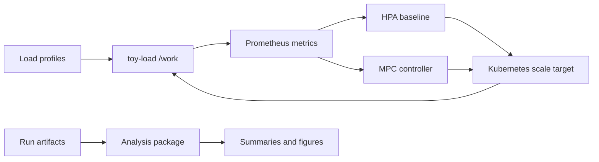

# Architecture

`mpc-autoscaler` is a research-oriented meta-repository. The root contains experiment tooling, reproducibility docs, monitoring assets, and release automation. `toy-load/` is the standalone Go service module used as the controlled workload.

## System View

## Main Components

| Path | Role |
| --- | --- |
| `toy-load/` | Controllable HTTP workload, Helm chart, raw manifests, Docker image. |
| `analysis/` | Python package for offline MPC simulation, live control, and artifact summaries. |
| `loadgen/scripts/` | Local and in-cluster experiment runners for HPA and MPC scenarios. |
| `deploy/monitoring/` | Kustomize stack for Prometheus and Grafana used during experiments. |
| `dashboards/` | Standalone Grafana dashboard JSON for manual import. |
| `experiments/` | Lightweight evidence index and archive packaging scripts. Raw runs stay ignored. |

## Control Loop

The live MPC controller reads observed demand and workload state from experiment inputs and Prometheus-derived artifacts, solves a short-horizon backlog-aware optimization problem, and applies replica decisions through Kubernetes when `--apply` is enabled.

Default behavior is safe for analysis work:

- offline commands never talk to Kubernetes;
- `mpc-control-loop` is dry-run unless `--apply` is passed;
- live scripts write new artifacts under ignored `experiments/_runs/` by default;
- curated thesis evidence is referenced through manifests instead of committing bulky raw data.

## Data Flow

1. `loadgen/scripts/` creates `step`, `spike`, or `seasonality` traffic.
2. `toy-load` exposes latency, request, in-flight, and work metrics.
3. HPA or MPC changes Deployment replicas.
4. Runners persist run metadata, Vegeta reports, replica watches, and MPC control logs.
5. `analysis/` turns saved artifacts into compact CSV summaries and figures.

## Source Of Truth

- Go service commands run inside `toy-load/` or through root Makefile wrappers.
- Python analysis commands run from repository root with `PYTHONPATH=analysis` or after `pip install -e analysis`.
- Live cluster experiments are launched from repository root.
- Release builds publish the `toy-load` binary, Helm chart, and GHCR image from `toy-load/`.

## Extension Points

Useful places to build on this project:

- add new traffic traces under `analysis/mpc_autoscaler_analysis/data/traces/`;
- add policy comparators in `analysis/mpc_autoscaler_analysis/offline/`;
- add runner variants under `loadgen/scripts/`;
- improve Prometheus/Grafana observability in `deploy/monitoring/` and `dashboards/`;
- harden the online control loop for broader Kubernetes setups.
